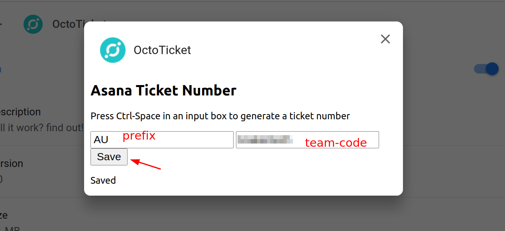

# Asana ticket generator

* Chrome [web store link](https://chrome.google.com/webstore/detail/octoticket/dejmonfcadndjgfgkemabednodepjgni?hl=en-GB&authuser=0)
* Firefox [web extentions link](https://addons.mozilla.org/en-US/firefox/addon/octoticket/)

## How to use

Click on the chrome extension icon and select 'options'

Then change the extension options: left side is `prefix`, right side is `company_key`

Use the same `prefix` and `company_key` as your teammates to all use the same ticket numbering system.

